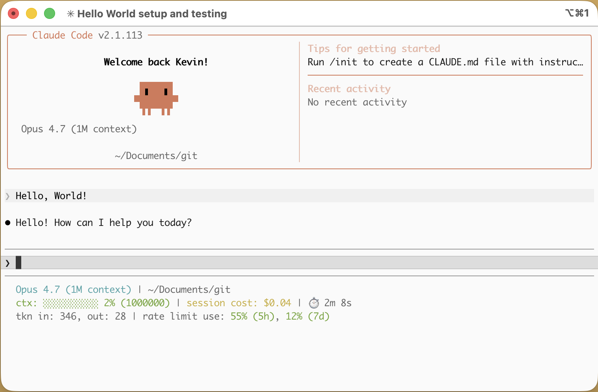

# AI Status Line
Display the latest statistics for your AI chat sessions inside the terminal.  Currently only supports Claude Code with ambitions to expand to other CLI-based AI tools down the road.

## Requirements
- Ruby and its core library
- Claude Code

## Setup
1. Clone this repo
1. Create a shell script in your `~/.claude` directory that calls `runner.rb`
1. Add it to your `~/.claude/settings.json`
    ```json
    {
      "statusLine": {
        "type": "command",
        "command": "~/.claude/your-shell-script.sh"
      }
    }
    ```
1. Start a new Claude Code session and you should see the session stats underneath the chat text box.

## Configuration 
The statistics can be customized through a config.yml file.  Make a copy of the included config.yml.example file and tweak the settings based on the example file's included instructions.

## Contributing
Contributions welcome. Please open a new issue first before submitting Pull Requests.

## License
See: [LICENSE.md](LICENSE.md)
